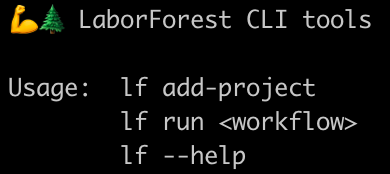

# CLI tools

## Overview
- NativePHP (via Electron) does not provide a way to specify command line arguments when launching an application
- A necessary workaround for this was a simple bash script that opens the application using NativePHP's deep linking

## Installing the CLI tools
- Use the button on the [Dashboard](dashboard.md) to install CLI tools
- This will create a bash script `lf` in the directory you specify (defaulting to `/usr/local/bin` if it exists)
  - You may be prompted for your password depending on the directory you choose

## Using the CLI tools

- run `lf add-project` to add the current working directory as a Project in LaborForest
- run `lf run <workflow>` to trigger the run of a Workflow in LaborForest using the current Workspace directory
- run `lf --help` to display the help message

### Cold start
- LaborForest does not need to be running in order to run the above commands
  - If the LaborForest application is not already running, it will be started before processing your command

