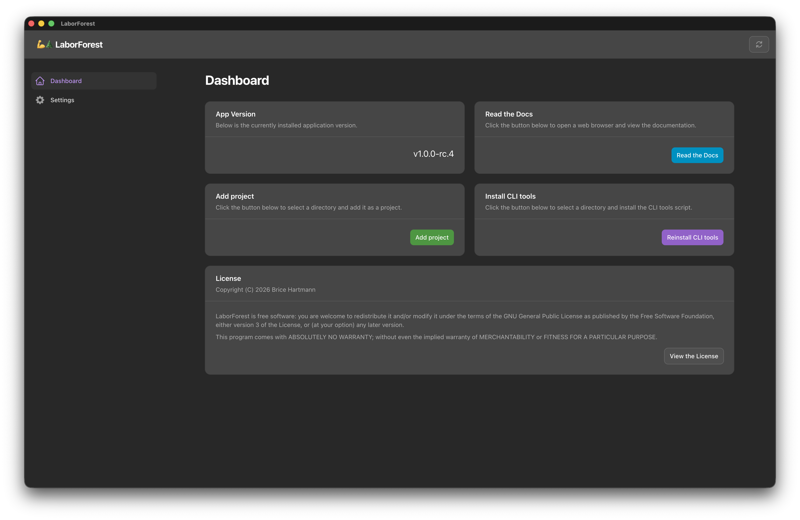

# Dashboard

## Overview

The Dashboard is the landing screen when you first open LaborForest. You can navigate back to it at any time using the menu on the left.

## Adding a project

Click the green `Add project` button and select the root of your project directory. The directory must already be a git repository, it must not already be registered with LaborForest, and its git status must be clean. Adding a project with uncommitted changes fails with an error notification.

Adding a project creates a `.laborforest` directory at the root of the repository, which leaves the repository dirty. LaborForest prompts you to commit that directory, exclude it locally, or leave it alone. See [Projects & Workspaces](projects-and-workspaces.md) for what each option does.

Once the project is added, LaborForest opens it automatically.

## Adding CLI tools

LaborForest ships with CLI tools that let you add a `Project` or run a `Workflow` from the command line. You must install them into a directory on your system `PATH` before you can use them. Read more about the CLI tools [here](cli-tools.md).

The `Install CLI tools` panel also has a `Dismiss` button. Dismissing hides the panel permanently, and there is no way to bring it back from the UI. To show it again, set `cli_tools_dismissed` to `false` in `~/.laborforest/settings.yaml`.

## Reading the Docs

Clicking `Read the Docs` opens the LaborForest documentation on GitHub in your default web browser.
