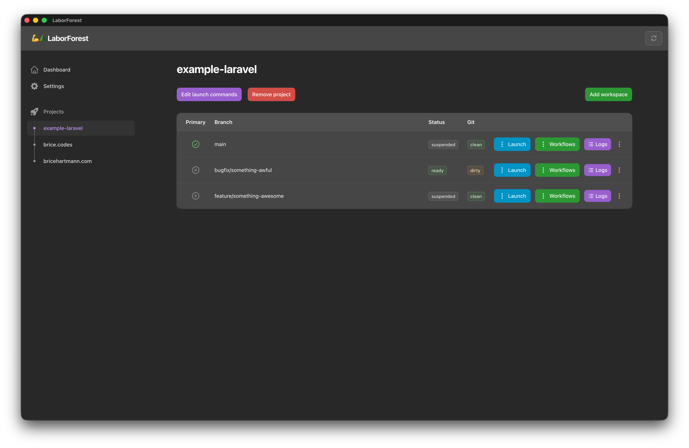
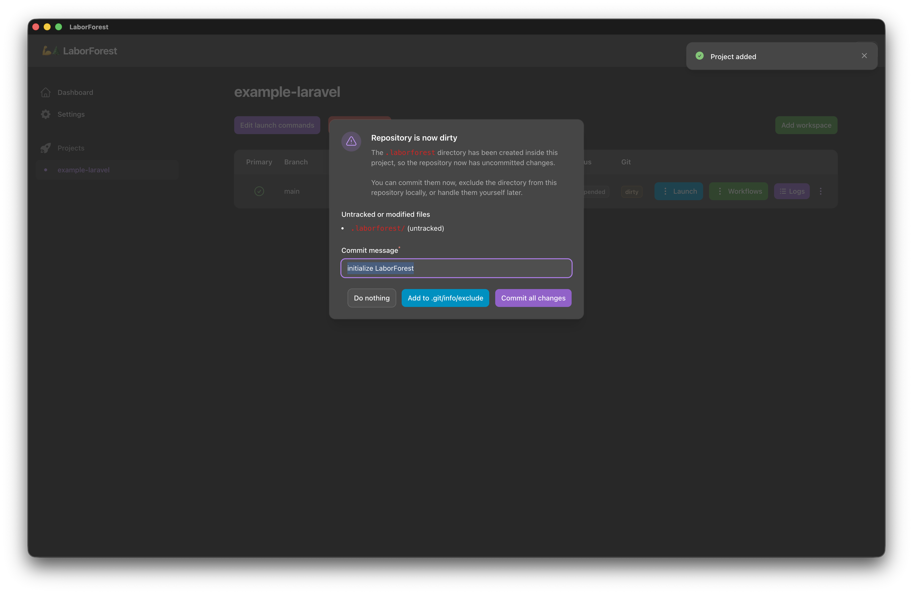
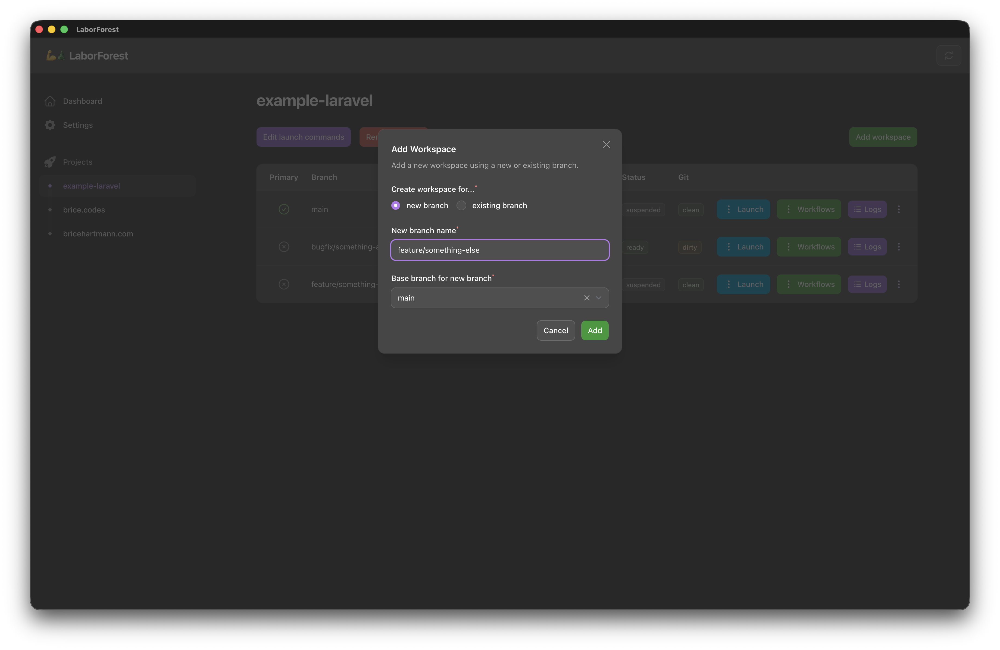
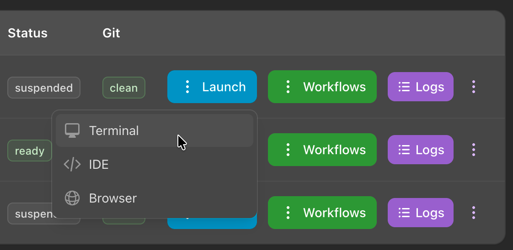
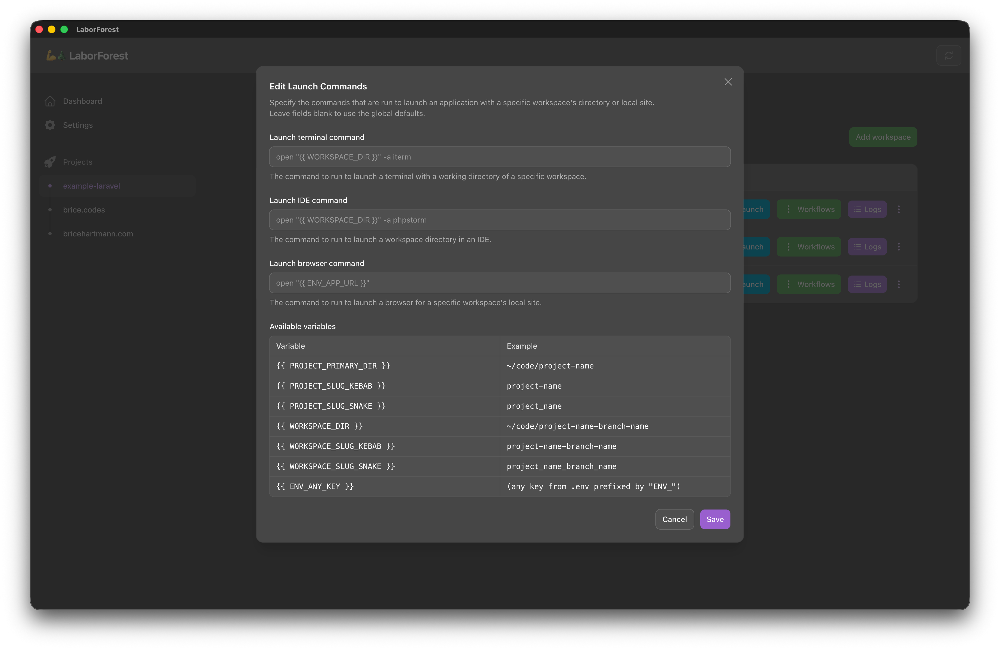
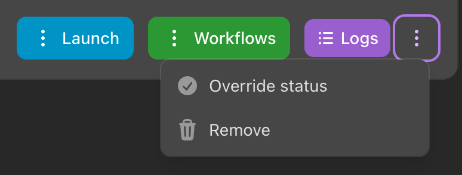
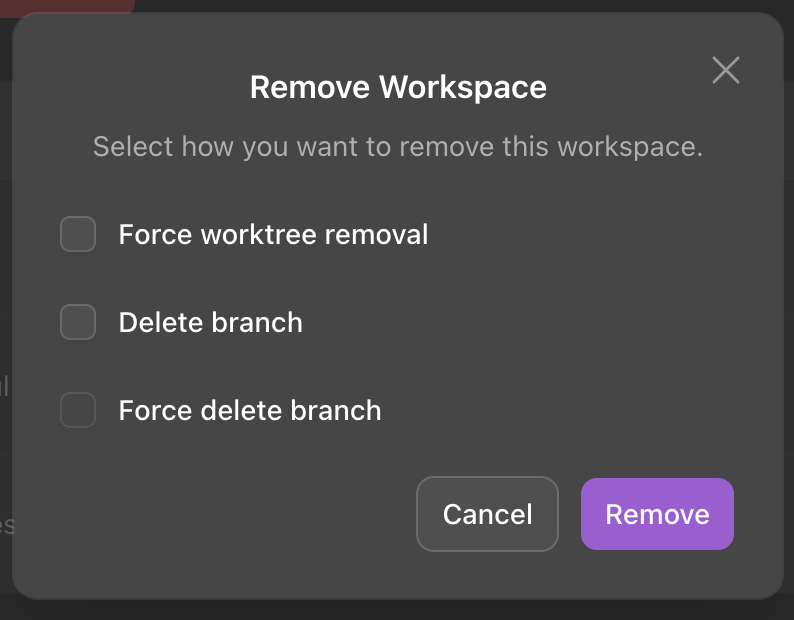
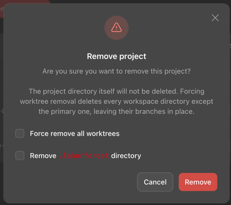

# Projects & Workspaces

## Overview
- Every `Project` LaborForest is aware of will appear in the menu on the left
  - Sorted by last opened, descending

## New Projects
- When you first add a `Project`, it will be opened in LaborForest automatically
- Adding a project creates a `.laborforest` directory at the root of your project directory
- You have the option to:
  - Commit the `.laborforest` directory
  - Add the `.laborforest` directory to `.git/info/exclude`
  - Do nothing (leave the git status dirty)
- If you are working on a team where multiple people are using LaborForest, you should commit the directory
- If you don't want LaborForest to leave any trace in your repository, you should add the directory to `.git/info/exclude`

## Adding a workspace
- You can add a `Workspace` to the open `Project` using the green button in the upper right
- When adding a `Workspace`, you have the option to choose between a new branch or an existing branch
- Upon adding your `Workspace`, a new git worktree will be created with your new or existing branch of choice checked out

## Launch menu button
- The `Launch` table row action button opens a menu where you can choose which Launch command to run
  - Click `Terminal` to run the configured command that opens your terminal with a working directory of your Workspace
  - Click `IDE` to run the configured command that opens your Workspace in your IDE of choice
  - Click `Browser` to run the configured command that opens the Workspace's local site in a web browser

## Editing launch commands
- Launch commands can be overridden at the `Project` level using the purple button in the upper left
  - Leave a command blank to use the global default for that command

## Workflows menu button
- The `Workflows` table row action button opens a menu where you can choose to run any `Workflow` that exists for the `Workspace`
- If no Workflows exist, you can click `Create example workflows` in the same menu, which will give the option to choose between which example Workflows you'd like to add

**Important**: Workflows are copied from the base branch at the time of Workspace creation. It is recommended to establish your Workflows in your `main` branch before continuing with additional Workspaces.

## Logs menu button
- The `Logs` table row action button takes you to a table of logs, one for each previous or ongoing Workflow run

## Extra actions menu button
- The extra row actions button (kebab menu) allows you to override a Workspace's status or remove the workspace entirely
- Overriding a Workspace's status can be useful if your Workflow run resulted in an error and manual clean up was required to get the Workspace back into a stable state

- Removing a Workspace cannot be done if the Workspace's status is `ready`, `working`, or `pending`
- Upon choosing to remove a Workspace, you have the options to force removal of the worktree, delete the branch, and if the branch should be force deleted

## Removing a project
- You can remove a Project using the red button near the top
- When removing a Project, you have the option to force-remove existing worktrees (not including the primary one) and the option to remove the `.laborforest` directory from the primary worktree
    - Removing the `.laborforest` directory may result in a dirty git status in your main worktree

