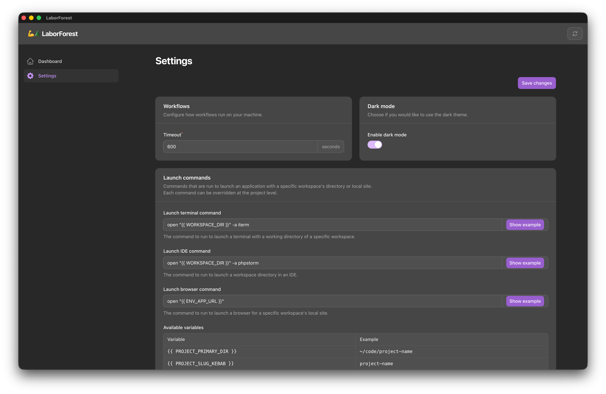

# Settings

## Overview
- Settings are where you can configure global settings for LaborForest
- You can navigate to Settings at any time using the menu on the left

## Workflow timeout
- You can edit the timeout for all Workflows by specifying a timeout in seconds
  - defaults to `10 minutes` (`600 seconds`)

## Dark mode
- You can specify if you'd like the Dark mode theme enabled with a toggle switch

## Launch commands
- Launch commands allow you to easily launch an application with a specific workspace's directory or local site
- Each command can be overridden at the `Project` level

### Launch terminal command
- The command to run when launching a terminal for the current workspace
  - Example is for `iTerm2`

### Launch IDE command
- The command to run to launch your IDE of choice, opening your current workspace
  - Example is for `PhpStorm`

### Launch browser command
- The command to run to launch a web browser with your current workspace's local site URL
  - only applicable to web projects
  - Example is for Laravel projects with the `APP_URL` stored in the environment variables file

### Available variables
- Each command supports a number of variables that can be injected, using mustache tags; e.g.: `{{ VARIABLE }}`
  - Examples values for each variable are shown in the table

| Variable                     | Example                                |
|------------------------------|----------------------------------------|
| `{{ PROJECT_PRIMARY_DIR }}`  | `~/code/project-name`                  |
| `{{ PROJECT_SLUG_KEBAB }}`   | `project-name`                         |
| `{{ PROJECT_SLUG_SNAKE }}`   | `project_name`                         |
| `{{ WORKSPACE_DIR }}`        | `~/code/project-name-branch-name`      |
| `{{ WORKSPACE_SLUG_KEBAB }}` | `project-name-branch-name`             |
| `{{ WORKSPACE_SLUG_SNAKE }}` | `project_name_branch_name`             |
| `{{ ENV_ANY_KEY }}`          | any key from `.env` prefixed by `ENV_` |

#### Environment file variables
- Variables prefixed with `ENV_` are special and denote loading a value from the Workspace's `.env` file
  - e.g.: `{{ ENV_FOO_BAR }}` loads the value under the key `FOO_BAR`
